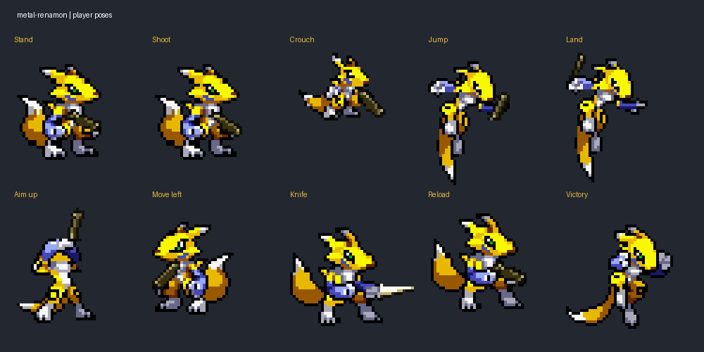

# metal-renamon

A Renamon player reskin of [nathancy/Metal-Slug](https://github.com/nathancy/Metal-Slug), maintained by [agammann](https://github.com/agammann).

The player artwork uses the [Renamon sheet from Digimon Battle Spirit](https://www.spriters-resource.com/game_boy_advance/digibat/asset/52334/), uploaded by Mr. C. The original gun and knife artwork is retained. Player PNG filenames and canvas dimensions are preserved, and the player and projectile code is unchanged. Controls, movement, animation timing, weapon behavior, enemies, maps, and sounds remain as in the upstream game. The title screen and window title display `metal-renamon`.



## Play in the browser

Open [metal-renamon](https://agammann.github.io/metal-renamon/), click **Play**, and wait for the loading screen to finish. Click inside the game and press **O** to start. Use **P** to pause and **O** to resume. The **Fullscreen** button enlarges the game.

A desktop browser, keyboard, and internet connection are required. The first launch downloads the Java runtime, images, and sounds, so it can take a while. The browser edition runs the existing Java game through [CheerpJ](https://cheerpj.com/); player, enemy, projectile, and main game code are shared with the desktop edition. Browser compatibility code in EZ resolves asset paths, handles frame timing, and plays the original sound files through browser audio.

To preview the browser edition locally with Python 3:

```sh
python scripts/serve-browser.py
```

Open `http://127.0.0.1:8000/`. This server supports the HTTP byte ranges needed by the runtime.

After editing Java sources, rebuild the browser JAR with a JDK 9 or later:

```powershell
./scripts/build-browser.ps1
```

Set `JAVA_HOME` to the JDK directory or put its tools on `PATH`. The JAR targets Java 8. GitHub Pages serves the repository's `master` branch from the root directory.

## Run on desktop

Requires a Java JDK 8 or later. From the repository root:

```sh
cd Metal_Slug
javac -d build src/*.java
java -cp build MetalSlug
```

Keep the working directory at `Metal_Slug` so the game can find its images and sounds. Press `o` at the instructions screen to start.

The objective is to destroy the enemies and reach the end of the map. Enemies have set health and also shoot projectiles at the user. There are 8 types of enemies which all have unique projectiles, sounds, and death animations. These include both land and flying units. Sprite animation and projectile explosion animations are also options. 


[](https://www.youtube.com/watch?v=85yrW6rgm-s "Original upstream gameplay")

# Features
### Player
  * Move two dimensionally around map
    * `w` - Up
    * `a` - Left
    * `s` - Crouch
    * `d` - Right
    * `spacebar` - Jump
    
  * Attack
    * `j` - Knife
    * `k` - Shoot bullets
    * `l` - Shoot grenades
    
  * Other
    * Victory animations
    * Periodic reload animations
    
### Enemies
  * Units
    * Airship
    * Helicopter
    * Mecha Robot
    * Scientist
    * Tank
    * Reinforced Tank
    * UFO
    * Zombie Macro
  * Unique sound, projectile, and death animations for enemies

### Other
  * Side scrolling map 
  * Scoreboard
  * Player jump shoot
  * Player crouch shoot
  * Player shoot up
  * `p` - pause
  * `o` - resume
  
# Development 
The sound and image capability is powered by the [EZ Graphics Library](http://www2.hawaii.edu/~dylank/ics111/). The game is built on four classes. 
* Enemy
* Initializer
* Player
* Projectile

The Enemy class controls all functions and features relating to all enemies. The Initializer class controls background music, map generation, and the options screen. The Player class controls all actions involving the player such as collision, animation, and states. The Projectile class controls all projectiles for both the player and all enemies. 
